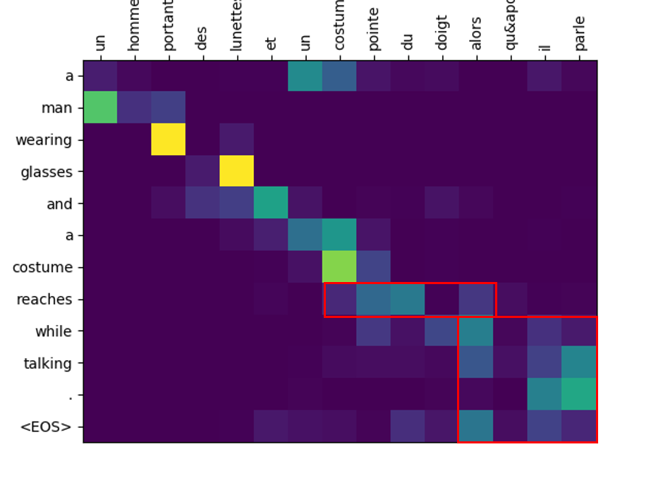

# 1. Examples
|        |Sentence                                                                               |
|---------------|-------------------------------------------------------------------------------------|
| French        | un homme portant des lunettes et un costume pointe du doigt alors qu&apos; il parle |
| English G.T.  | a man wearing glasses and a suit points the finger as he speaks                     |
| Translated    | a man wearing glasses and a costume reaches while talking .                         |

# 2. Score
| Model                                | BLEU  |
|--------------------------------------|-------|
| Concat attention with bucket sampler | 26.14 |
| Dot attention with bucket sampler    | 26.65 |
| Dot attention without bucket sampler | 27.23 |

# 3. Implementation

* Training set: Multi30k dataset (29,000 French and English sentences, each)
* Memory efficiency: Bucket sampler implemented for similar sentence-length within batch
* Word representation: nn.Embedding, not transferred from Word2vec or other representations
* GRU-based encoder, decoder for source and target language sequence, respectively.
* Dot product & concat attention for aligning source language and target language.

# 4. TODO
* Transferring word representation from Word2vec or Glove will improve the score.
